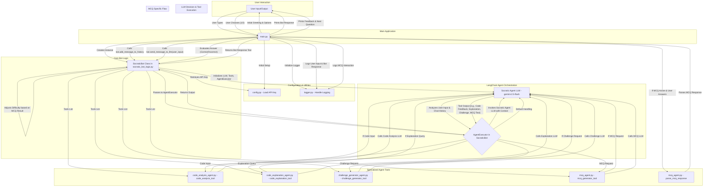

```mermaid
graph TD
    subgraph User Interaction
        A[User Input/Output]
    end

    subgraph Main Application
        B(main.py)
    end

    subgraph Core Bot Logic
        C(SocraticBot Class in socratic_bot_logic.py)
    end

    subgraph Configuration & Utilities
        D[config.py - Load API Key]
        E[logger.py - Handle Logging]
    end

    subgraph LangChain Agent Orchestration
        F{AgentExecutor in SocraticBot}
        G[Socratic Agent LLM - gemini-2.5-flash]
    end

    subgraph Specialized Agent Tools
        H[code_analysis_agent.py - code_analysis_tool]
        I[code_explanation_agent.py - code_explanation_tool]
        J[challenge_generator_agent.py - challenge_generator_tool]
        K[mcq_agent.py - mcq_generator_tool]
        L[mcq_agent.py - parse_mcq_response]
    end

    A -- User Types --> B
    B -- Initial Setup --> D
    B -- Initialize Logger --> E
    B -- Creates Instance --> C
    C -- Retrieves API Key --> D
    C -- Initializes LLM, Tools, AgentExecutor --> G
    C -- Tools List --> H
    C -- Tools List --> I
    C -- Tools List --> J
    C -- Tools List --> K

    B -- Initial Greeting & Options --> A
    A -- User Chooses (1/2) --> B
    B -- Calls bot.add_message_to_history --> C
    B -- Calls bot.send_message_to_llm(user_input) --> C

    C -- Passes to AgentExecutor --> F
    F -- Invokes Socratic Agent LLM with Context --> G

    subgraph LLM Decision & Tool Execution
        G -- Analyzes User Input & Chat History --> F

        F -- Code Input --> H
        F -- Explanation Query --> I
        F -- Challenge Request --> J
        F -- MCQ Request --> K
        F -- Default Handling --> G

        H -- If Code Input --> G
        I -- If Explanation Query --> G
        J -- If Challenge Request --> G
        K -- If MCQ Request --> G

        H -- Calls Code Analysis LLM --> G
        I -- Calls Explanation LLM --> G
        J -- Calls Challenge LLM --> G
        K -- Calls MCQ LLM --> G
    end

    G -- Tool Output (e.g., Code Feedback, Explanation, Challenge, MCQ Text) --> F
    F -- Returns Output --> C

    C -- Adds Bot Response to History --> C
    C -- Adjusts Difficulty (Heuristic) --> C
    C -- Updates Current Topic --> C
    C -- Returns Bot Response Text --> B
    B -- Prints Bot Response --> A
    B -- Logs User Input & Bot Response --> E

    subgraph MCQ Specific Flow
        B -- If MCQ Active & User Answers --> L
        L -- Parses MCQ Response --> B
        B -- Evaluates Answer (Correct/Incorrect) --> C
        C -- Adjusts Difficulty based on MCQ Result --> C
        B -- Prints Feedback & Next Question --> A
        B -- Logs MCQ Interaction --> E
    end
```
